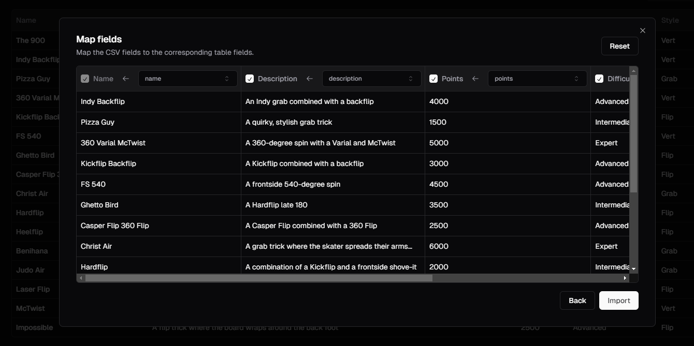

# [CSV Importer](https://importer.sadmn.com)

This is a csv-importer built with `shadnc/ui`, `radix ui`, `react-dropzone`, and `papaparse`. It is bootstrapped with `create-t3-app`.

[](https://importer.sadmn.com)

## Tech Stack

- **Framework:** [Next.js](https://nextjs.org)
- **Styling:** [Tailwind CSS](https://tailwindcss.com)
- **UI Components:** [shadcn/ui](https://ui.shadcn.com)
- **DND Uploader:** [react-dropzone](https://react-dropzone.js.org/)
- **Storage:** [uploadthing](https://uploadthing.com)
- **CSV Parsing:** [Papaparse](https://www.papaparse.com)

## Features

- [x] Upload CSV file
- [x] Parse CSV file
- [x] Preview CSV file in a table
- [x] Map CSV fields to corresponding table fields
- [x] Import CSV data to database

## Running Locally

1. Clone the repository

   ```bash
   git clone https://github.com/sadmann7/csv-importer
   ```

2. Install dependencies using pnpm

   ```bash
   pnpm install
   ```

3. Start the development server

   ```bash
   pnpm run dev
   ```

## How do I deploy this?

Follow the deployment guides for [Vercel](https://create.t3.gg/en/deployment/vercel), [Netlify](https://create.t3.gg/en/deployment/netlify) and [Docker](https://create.t3.gg/en/deployment/docker) for more information.
